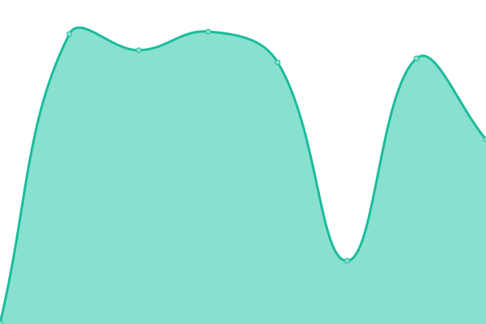
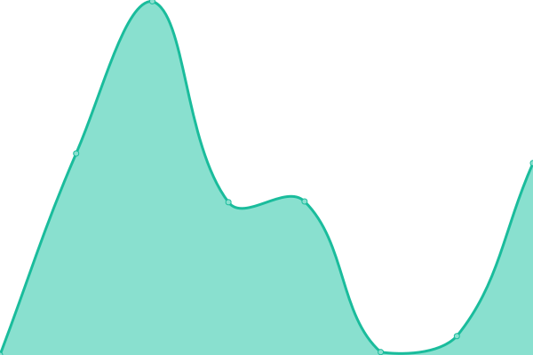
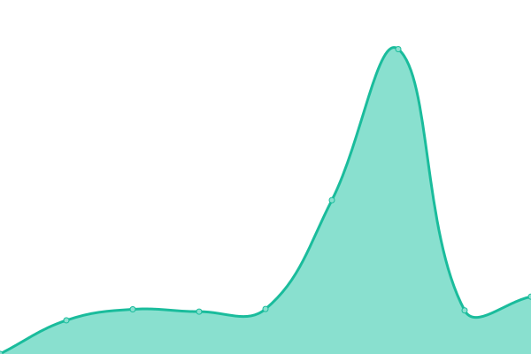
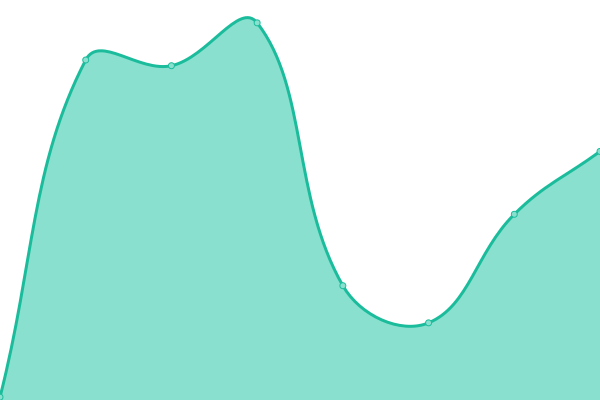

# [📈 Live Status](https://iscsdown2.bang1338.xyz): <!--live status--> **🟧 Partial outage**

This repository contains the open-source uptime monitor and status page for [Bang1338](https://comic.studio/u/Bang1338), powered by [Upptime](https://github.com/upptime/upptime).

With [Upptime](https://upptime.js.org), you can get your own unlimited and free uptime monitor and status page, powered entirely by a GitHub repository. We use [Issues](https://github.com/bang1338/iscsdown 2/issues) as incident reports, [Actions](https://github.com/bang1338/iscsdown 2/actions) as uptime monitors, and [Pages](https://iscsdown2.bang1338.xyz) for the status page.

<!--start: status pages-->
<!-- This summary is generated by Upptime (https://github.com/upptime/upptime) -->
<!-- Do not edit this manually, your changes will be overwritten -->
<!-- prettier-ignore -->
| URL | Status | History | Response Time | Uptime |
| --- | ------ | ------- | ------------- | ------ |
|  [Comic Studio](https://comic.studio) | 🟩 Up | [comic-studio.yml](https://github.com/Bang1338/iscsdown-2/commits/HEAD/history/comic-studio.yml) | 

 359ms
     
 | 

<a href="https://bang1338.github.io/iscsdown-2/history/comic-studio">0.00%</a>
    

|  [Comic Studio CDN](https://cdn.comic.studio) | 🟩 Up | [comic-studio-cdn.yml](https://github.com/Bang1338/iscsdown-2/commits/HEAD/history/comic-studio-cdn.yml) | 

 4512ms
     
 | 

<a href="https://bang1338.github.io/iscsdown-2/history/comic-studio-cdn">100.00%</a>
    

|  [bang1338 (domain)](https://bang1338.xyz) | 🟩 Up | [bang1338-domain.yml](https://github.com/Bang1338/iscsdown-2/commits/HEAD/history/bang1338-domain.yml) | 

 1342ms
     
 | 

<a href="https://bang1338.github.io/iscsdown-2/history/bang1338-domain">69.12%</a>
    

|  [bang1338 (github)](https://bang1338.github.io) | 🟥 Down | [bang1338-github.yml](https://github.com/Bang1338/iscsdown-2/commits/HEAD/history/bang1338-github.yml) | 

 47ms
     
 | 

<a href="https://bang1338.github.io/iscsdown-2/history/bang1338-github">0.00%</a>
    

<!--end: status pages-->

[**Visit our status website →**](https://iscsdown2.bang1338.xyz)

## 📄 License

- Powered by: [Upptime](https://github.com/upptime/upptime)
- Code: [MIT](./LICENSE) © [Bang1338](https://comic.studio/u/Bang1338)
- Data in the `./history` directory: [Open Database License](https://opendatacommons.org/licenses/odbl/1-0/)
